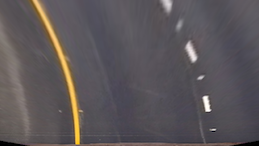
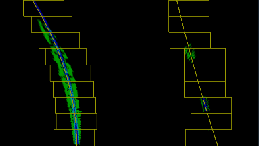
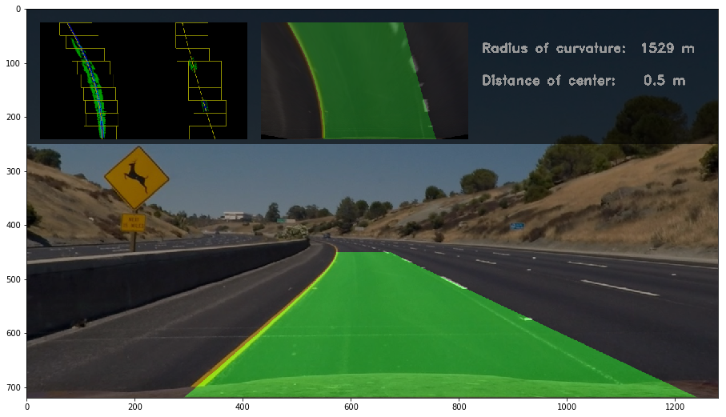

# CarND-Advanced-Lane-Finding

The goal of this project is to identify road lanes in a video stream of a forward facing camera mounted centeraly in a moving vehicle.

We'll be using image manipulation techniques to extract enough information from each frame, or image, of the video and identify the lane lines, the radius of curvature and the distance from the camera to the center line of the road.


## Project Structure

- `camera_cal/` Directory with calibration images
- `test_images/` Directory with test images 
- `output_images/` Directory with test images with augmented overlay
- `videos/` Directory with input and output videos 
- `Advanced-Lane-Finding.ipnyb` Jupyter notebook with all the project code and example images
- `README.md` Projecte writeup (you're reading it)

## Project Overview

In order to detect the lane lines in a video stream we must accomplish the folowing:

- **Camera Calibration** - Calibrate the camera to correct for image distortions. For this we use a set of chessboard images, knowing the distance and angles between common features like corners, we can calculate the tranformation functions and apply them to the video frames.

- **Color Transform** - We use a set of image manipulation techniques to accentuate certain features like lane lines. We use color space transformations, like from RGB to HLS, channel separation, like separating the S channel from the HLS image and image gradient to allow us to identify the desired lines.

- **Perspective Transform** - We apply a "bird’s-eye view transform" that let's us view a lane from above and thus mesure its curvature and respective radious.

- **Lane Pixel Detection** - We then analyse the transformed image and try to detect the lane pixels. We use a series of windows and identify the lane lines by finding the peeks in a histogram of eah window.

- **Image augmentation** - We add a series of overlays to the image to: identify the lane lines, show the "bird's eye view" perspective, show the location of the rectangle windows where the lane pixels are and finaly metrics on the radius of curvature and distance to the center of the road.

- **Pipeline** - We finally put it all together in a pipeline so we can apply it to the video stream.

## Camera Calibration

Before we can use the images from the front facing camera we must calibrate it so we can correctly measure distances between features in the image.

To do this we first must find the calibration matrix and distortion coefficients for the camera given a set of chessboard images.

We start by preparing a pattern variable to hold the coordinates of the chessboard's squares

```python
pattern = np.zeros((pattern_size[1] * pattern_size[0], 3), np.float32)
pattern[:, :2] = np.mgrid[0:pattern_size[0], 0:pattern_size[1]].T.reshape(-1, 2)
```

we then loop through each image, convert it to grayscale, and try to find the chessboard corners with `OpenCV` `findChessboardCorners` function.

```python
image = mpimg.imread(path)
# convert to grayscale
gray = cv2.cvtColor(image, cv2.COLOR_RGB2GRAY)
# find the chessboard corners
f, corners = cv2.findChessboardCorners(gray, pattern_size, None)
```

In the case where we can find the corners we add them to our `pattern_points` and `image_points` so we can later use them to calibrate the camera

```python
if f:
    pattern_points.append(pattern)
    image_points.append(corners)
    image_size = (image.shape[1], image.shape[0])    
```

Finally we calibrate the camera and get our matrix and distortion 

```python
matrix, dist = cv2.calibrateCamera(pattern_points, image_points, image_size, None, None)
```

In some images it was not possible to identify the corners, so we'll use them to test the calibration:
Here's one example:


> For full implementation details please see the [jupyter notebook](Advanced-Lane-Finding.ipynb)

## Color Transform

Here we use a series of image manipulation techniquest to detect the edges of an image

We start by getting the **gradient absolute value** using `OpenCV` Sobel operator

```python
sobel = np.absolute(cv2.Sobel(image, cv2.CV_64F, 1, 0, ksize=sobel_ksize))
x = cv2.Sobel(image, cv2.CV_64F, 1, 0, ksize=sobel_ksize)
```

We then calculate the **gradient magnitude**

```python
x = cv2.Sobel(image, cv2.CV_64F, 1, 0, ksize=sobel_ksize)
y = cv2.Sobel(image, cv2.CV_64F, 0, 1, ksize=sobel_ksize)

magnit = np.sqrt(x**2 + y**2)
```

And the **gradient direction**

```python
x = cv2.Sobel(image, cv2.CV_64F, 1, 0, ksize=sobel_ksize)
y = cv2.Sobel(image, cv2.CV_64F, 0, 1, ksize=sobel_ksize)

direct = np.arctan2(np.absolute(y), np.absolute(x))
```

Finally we extract the `S` channel from the `HLS` color space and apply a threshold to it

```python
# Convert to HLS space
hls = cv2.cvtColor(np.copy(image), cv2.COLOR_RGB2HLS).astype(np.float)
# Separate and get the S channel
s = hls[:, :, 2]
```

We apply all these transformations so we can identify the edges on the lane lines, here's an example:


> For full implementation details please see the [jupyter notebook](Advanced-Lane-Finding.ipynb)

## Perspective Transform

I defined a matrix of source and destination points in the images as to transform them to the "bird's eye view" using `OpenCV` `getPerspectiveTransform` function. 

Here you can see the defined vertices for the "region of interest"

```python
height = image.shape[0]
width = image.shape[1]
# Vertices coordinates in the source image
s1 = [width // 2 - 76, height * 0.625]
s2 = [width // 2 + 76, height * 0.625]
s3 = [-100, height]
s4 = [width + 100, height]
src = np.float32([s1, s2, s3, s4])
# Vertices coordinates in the destination image
d1 = [100, 0]
d2 = [width - 100, 0]
d3 = [100, height]
d4 = [width - 100, height]
dst = np.float32([d1, d2, d3, d4])
```

And here the actual transformation:

```python
# Given src and dst points we calculate the perspective transform matrix
M = cv2.getPerspectiveTransform(src, dst)
# Warp the image
warped = cv2.warpPerspective(image, M, (width, height))
# We also calculate the oposite transform
unwrap_m = cv2.getPerspectiveTransform(dst, src)
```

Here's an example of the transformation:


> For full implementation details please see the [jupyter notebook](Advanced-Lane-Finding.ipynb)


## Lane Pixel Detection

The next challenge is, by using the transformed image, identify the lane line pixels.
To accomplish this we'll use a method called "Peaks in a Histogram" where we analyse the histogram of section of the image, window, and identify the peaks which represent the location of the lane lines.

To abstract this we've create a few classes: 

- **SlidingWindow** - Where we represent "these" sections of the image where it's more likely to find a lane line, the "hot" pixels. The class defines the top and bottom coordinates for the vertices of the rectanglar window 

- **LaneLine** - This class represents each of the lane lines in the image, in this case the `left` and `right` lines. It calculates the equation of the curve of the line and returns `radius_of_curvature` and `camera_distance` from the center line. This class also includes all the assumptions like the width of the lanes, `3.7` meters, and the length of the lane in the image, `30` meters

Here's an example of the lane lines detected:

 

> please do see the [jupyter notebook](Advanced-Lane-Finding.ipynb) for more details.


## Image augmentation

In order to augment the video, and its respective frames, we've created a series of overlays to add additional information to the stream.

**In the top left corner** - Adds a representation of the windows in the transformed image and identifies the lanes and its curvature

**In the top center** - A "bird's eye" view with the lane identified

**In the top right corner** - Metrics on the radius of curvature and distance to the center line

**in the lower two thirds** - The actual image with the lane boundaries identified and colored for effect.

Here's an example augmented image:


